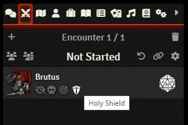

# FoundryVTT | Combat Tracker Effect Tooltips

This simple module for FoundryVTT adds tooltips to the effect icons shown on combatants in the combat tracker.

## Credit
This is a fork of [the original](https://github.com/schultzcole/FVTT-Combat-Tracker-Effects-Tooltips) by [Cole Schultz](https://github.com/schultzcole) - thanks to him for this useful little module.

## License

Licensed under the GPLv3 License (see [LICENSE](LICENSE)).